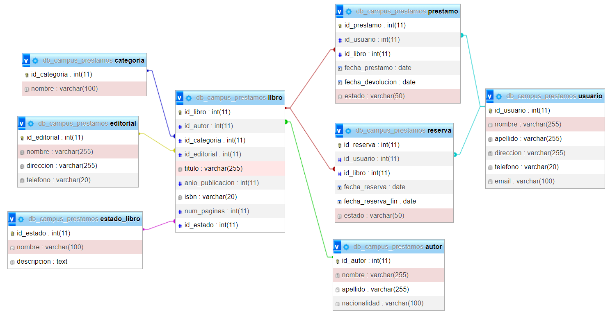
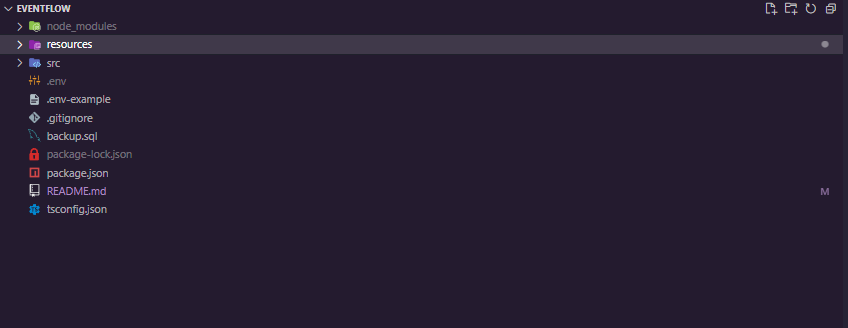
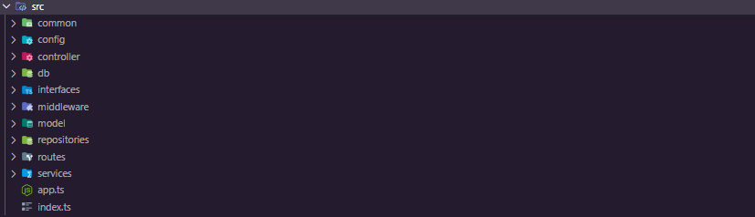

# Biblioteca Campus by: ***@DatBrian***

# Esquema de la base de datos:



## Descripción del proyecto:
#### Proyecto que contiene el Back-end para un aplicativo de gestión de una biblioteca en la que se pueden almacenar y tratar los distintos datos y entidades de manera óptima y organizada.

---

## Técnologías utilizadas:
#### Para este proyecto se utilizó el entorno de ejecución **NodeJS** con su framework [ExpressJS](https://expressjs.com/). Para la base de datos se utilizó **MySQL** y la librería [mysql2](https://github.com/sidorares/node-mysql2) para la implementación de la misma en el código, también se utilizaron librerías como [class-transformer](https://github.com/typestack/class-transformer) y [class-validator](https://github.com/typestack/class-validator) para validaciones y dto, por otro lado se implemento JWT con la librería [jose](https://www.npmjs.com/package/jose) en conjunto con cookies utilizando [cookie-parser](https://www.npmjs.com/package/cookie-parser) todo el código está en **TypeScript** para proporcionar un tipado estático.
##### (El resto de dependencias se podrán visualizar en el archivo package.json que en su mayoría son de desarrollo ya que las necesarias para producción son las que se acabaron de mencionar.)

---

## Estructura y Configuración:
### **Directorio Raíz:**
#### En el directorio raíz se encuentran los archivos principales de configuración sin entrar aún al código.


#### 

- #### La carpeta [node_modules](node_modules) es la que se creará al inicializar el proyecto y contiene todas los archivos necesarios para las dependencias que se vayan a utilizar.

- #### La carpeta [src](src) contiene todo el código del proyecto.

- #### El archivo .env-example es el que se utilizará más adelante para configurar las variables de entorno.

- #### El archivo [package.json](package.json) al igual que la carpeta [node_modules](node_modules) se creará automáticamente al inicializar el proyecto y aqui se podrán realizar configuraciones del mismo y de las dependencias que este contiene.

- #### El archivo [tsconfig.json](tsconfig.json) es el archivo que contiene todas las configuraciones necesaarias para que **TypeScript** funcione correctamente.

### **Carpeta del proyecto ([src](src)):**


- `index.ts`: Archivo principal que inicializa la aplicación y configura las rutas.
- `app.ts`: Archivo principal que configura la aplicación Express y establece las rutas y middlewares.
- `common/`: Carpeta que contiene funciones comunes y una clase de enrutador común.
- `config/`: Carpeta que contiene archivos de configuración, como `ConnectDataSource.ts` para la conexión a la base de datos y `EnvConfig.ts` para las variables de entorno.
- `controllers/`: Carpeta que contiene los controladores de cada entidad, como `CitasController.ts`.
- `db/`: Carpeta que contiene la lógica de conexión a la base de datos y el manejo del datasource, como `Connection.ts` y `DataSource.ts`.
- `interfaces/`: Carpeta que contiene las interfaces utilizadas en el proyecto, como `RoutesInterface.ts`.
- `middlewares/`: Carpeta que contiene los middlewares utilizados en las rutas, como `ValidateMiddlewareDTO.ts`.
- `model/`: Carpeta que contiene los modelos de datos, como DTO y entidades.
- `model/dto/`: Carpeta que contiene los objetos de transferencia de datos (DTO), como `CitasDTO.ts`.
- `model/entities/`: Carpeta que contiene las entidades del dominio, como `CitasEntity.ts`.
- `services/`: Carpeta que contiene la lógica de negocio, como `Service.ts`.
- `repositories/`: Carpeta que contiene los repositorios de datos, como `CitasRepository.ts` en los que se realizan las consultas.
- `routes/`: Carpeta que contiene las rutas de la aplicación, como `CitasRoutes.ts`.

## **Inicialización:**

1. Primero debes encontrarte en la carpeta del proyecto luego de clonar el repositorio, puedes utilizar el siguiente link:
[https://github.com/DatBrian/bibliotecaCampus.git](https://github.com/DatBrian/bibliotecaCampus.git).

2. Al tener el proyecto en tu equipo abrelo, entra a la carpeta raíz desde la terminal y ejecuta el siguiente comando para instalar todas las dependencias:

```
npm install
```

3. Crea la base de datos: tendrás que crear una base de datos donde almacenarás el script utilizado aqui, el nombre puede ser de tu preferencia

4. Importa la base de datos: en el directorio raíz encontrarás un archivo [backup.sql](backup.sql) el cual solo tendrás que ejecutarlo en una consola de mysql dentro de la base de datos que creaste en el punto anterior.

5. Cambia el nombre del archivo [.env-example](.env-example) a **.env**

6. Dentro del archivo **.evn** configura las variables de entorno según tus configuraciones siguiendo los ejemplos expuestos en el mismo.

7. Ejecuta el siguiente comando para inicializar todos los servicios y en la consola se mostrarán las demás instrucciones:

```
npm run start:dev
```

## Ruta de archivos:
#### Aquí se muestra como funciona el proyecto y la ruta que recorren los datos y peticiones dentro de la estructura previamente explicada:

1. Al realizar la petición al servidor la ruta de la solicitud se compara con las rutas definidas en [app.ts](./src/app.ts) las cuales se llaman en el archivo principal [index.ts](./src/index.ts).

2. Ya en el archivo [app.ts](./src/app.ts) se configuran las rutas llamando al respectivo archivo de clase dependiendo de la ruta especificada anteriormente como por ejemplo [Routes.ts](./src/routes/CitasRoutes.ts), en este archivo también se configuran **middlewares** el de recibir **json** y se inicializan todas las rutas.

3. Ya en los archivos de rutas específicos se definirán todos los **EndPoints**  y llamará al controlador de cada una de las rutas cuando se llame a su respectivo **path**, aqui también se configuran **middlewares** necesarios como el de generar JWT o en casos validar datos de entrada.

4. En el controlador se definen los métodos que se van a utilizar en la consulta y llama al archivo de servicio pasándole todo lo necesario al archivo de servicio para su correcto funcionamiento, en este caso se utiliza para obtener el JWT de la cookie.

5. En el archivo de servicio se realizará toda la lógica de negocio necesaria como desencriptar el JWT o realizar validaciones extra, todo para llamar al archivo de repositorio el que realizará las consultas y interactuará con la base de datos.

6. En el archivo de repositorio se realizará la respectiva consulta y esto devolverá la información necesaria la cual va a recorrer de nuevo toda la ruta anterior de manera inversa hasta mostrar los resultados.

7. Desde el archivo de repositorio no se tocará la base de datos pero si se llamará a una clase MethodsCommon la cual contiene plantillas para realizar las consultas, cada una se llama desde el archivo de repositorio.

# **EndPoints:**
### Todos los **EndPoints** disponibles se muestran en la consola al ejecutar el comando indicado en la sección de inicialización, a continuación se dará una breve explicacion de lo que hacen.


### **http://"***tu host***":***"tu puerto"***/api/v1/{nombre de la entidad}** -> Esta es la estructura base de los EndPoints y a partir de ahi se empezarán a construir.

## GET

- ### Todos los EndPoints **GET** que después del nombre de la entidad tengan ***/all*** serán para obtener todos los resultados ya sea de la entidad o de alguna consulta extra pero obtendrá todos los resultados.

- ### Todos los EndPoints **GET** que después del nombre de la entidad tengan ***/id*** serán para obtener un resultado específico y tendrá que pasarse en el body el id.

## Otros casos con este método:


- ###  -> Este EndPoint se utiliza para obtener todos los libros disponibles

## DELETE

- ### Topos los EndPoints **DELETE** cumplen la misma función de eliminar alguna dato de una entidad, se pueden reconocer porque después del nombre de la entidad tienen **/delete**.

## **Consumo:**
### Para hacer los post es necesario pasar un cuerpo válido que pueda ser aceptado por la base de datos, estas estructuras para las peticiones están definidaas dentro de la caarpeta [entities](./src/model/entities) de la carpeta [model](./src/model/), allí se encontrarán todas las entidades asociadas a las tablas de la base de datos y pueden utilizarse para crear la petición de manera correcta, en todo caso al enviar datos erróneos se mostrarán excepciones con los detaalles y en casos de haber algun error en las entidades puedes consultas los archivos de **DTO** dentro de la misma carpeta [model](./src/model/).

---

last-update: 23/07/2023 - @DatBrian